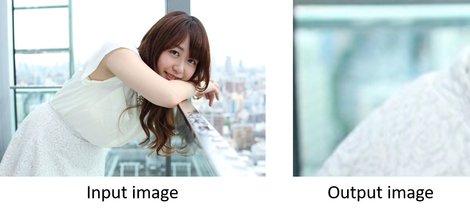
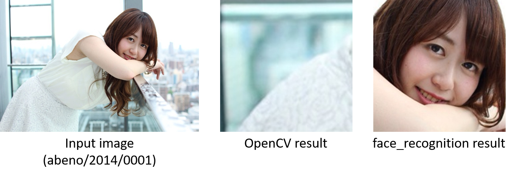
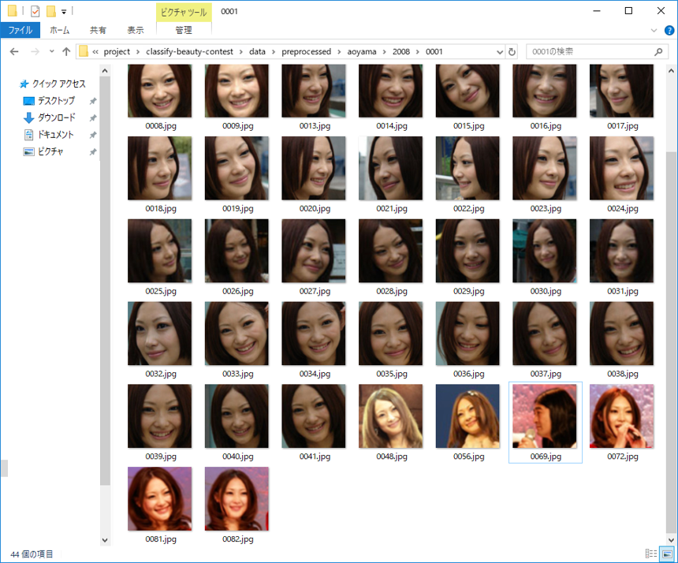
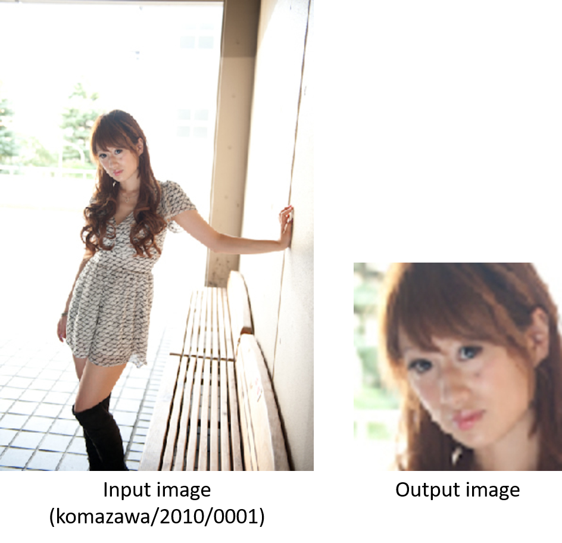
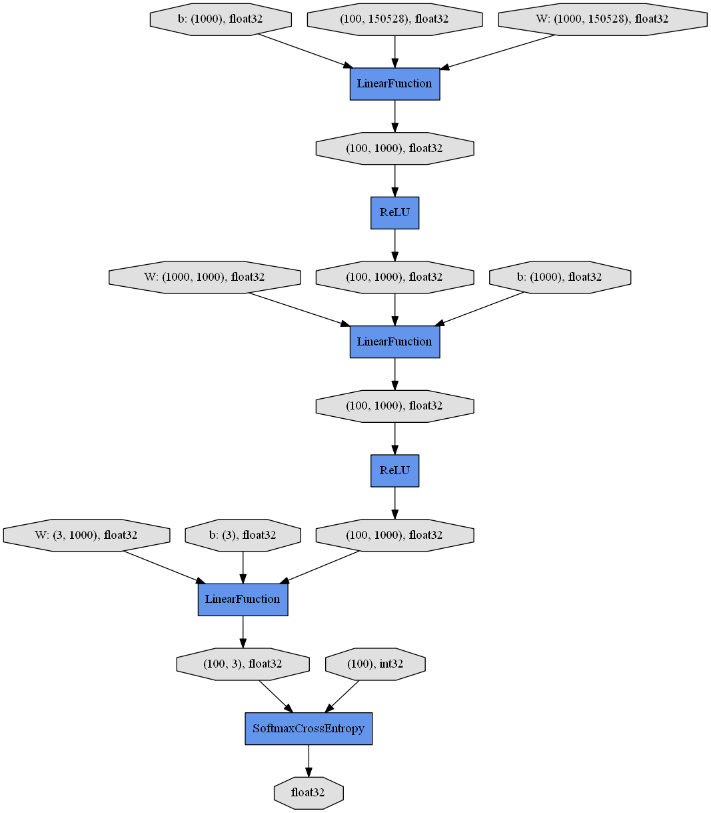
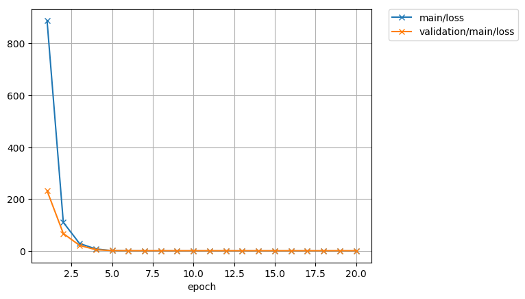
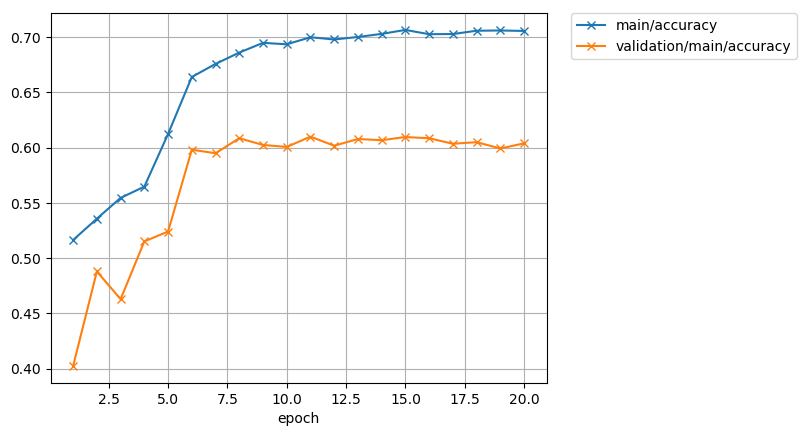
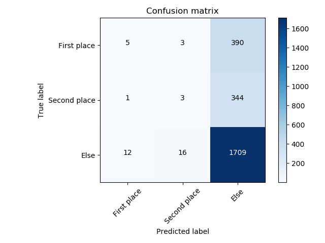
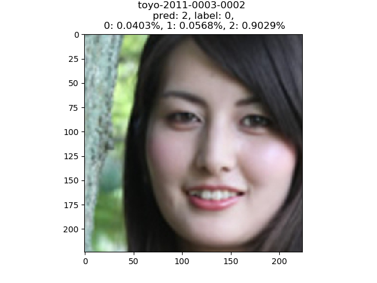
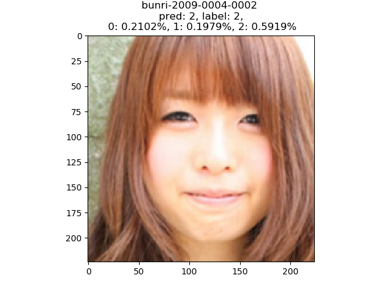

# Classify beauty contest

### Purpose

グランプリと準グランプリを取る人を当てる

### Procedures

#### 1. データの用意

1. 画像のデータとアノテーションを以下のサイトよりスクレイビングする

    - [MISS COLLE](https://misscolle.com/)

    ```
    # Scrape image data
    python source/data/scrape_data.py
    # Scrape annotation info
    python source/data/annotate_data.py
    ```

2. `misshoge` と `hoge` のような表記ゆれが存在するので、これを消す

    ```
    python source\data\change_orthographic_variants.py
    ```

3. 顔のクロップ

    - OpenCVの顔検出をすると，次のように検出に失敗するので， [face_recognition](https://github.com/ageitgey/face_recognition) を使用する

      - 分類器は，[ここ](https://github.com/opencv/opencv/tree/master/data/haarcascades)か[ここ](https://github.com/opencv/opencv_contrib/tree/master/modules/face/data/cascades)からダウンロードした

      - OpenCV 実行結果

        

    - How to install `face_recognition`

      ```
      # Make sure already installed visual studio 2015
      pip install cmake
      pip install face_recognition
      # Ref. https://github.com/ageitgey/face_recognition/issues/175#issuecomment-426216930
      ```

    - 画像は，224x224にBicubicを用いて，リサイズする

      ```
      python source\data\face_detecter.py
      ```

    - 実行結果

      

4. データの選択

    - 変なデータが混じっていないか，人力で取捨選択

      

    - Bicubic補間や解像度の問題より，ジャギーが乗っている画像が存在するが，今回はすべて使う

      

    - コンテスト参加者数 は `2011` 人

5. データの分割

    - train 60% (7964枚), validation 20% (2798枚), test 20% (2483枚)に分割する

    - 今回は，コンテスト参加者ごとに分割した．なので，1206人が訓練データ，402人が検証データ，403人がテストデータとなる

    ```
    python dataset.py
    ```

#### 2. モデルの訓練とテスト

- 今回は，chainer の　[mnistのサンプル](https://github.com/chainer/chainer/blob/master/examples/mnist/train_mnist.py) をもとにする

  ```
  python training.py -g 0
  ```

- ネットワーク構造

  

- 学習経過

   

- テスト

  ```
  python inference.py -g 0 -m result/Classifier_1593.npz
  ```

- テスト結果

  - Confusion matrix

    

  - 推定例

    

### まとめ

- ほとんど外した．

- データの分割方法は検討すべき

- 学習データがおそらく，不均一データ

### References

- [ある美女が，どの大学にいそうかを CNN で判別する](https://qiita.com/pika_shi/items/3c8ab1a8ecc655b33851)
